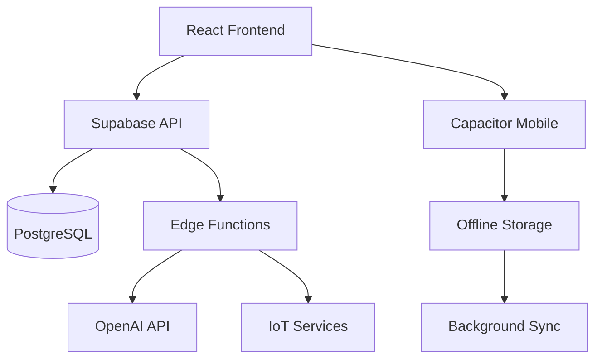

# Pavement Performance Suite 🏗️

> Comprehensive AI-assisted platform for asphalt paving and sealing business operations

[](https://opensource.org/licenses/MIT)
[](https://reactjs.org/)
[](https://www.typescriptlang.org/)
[](https://supabase.com/)
[](https://capacitorjs.com/)

## 🚀 Quick Start

### Prerequisites
- Node.js 18+ 
- npm or yarn
- Git

### Installation
```bash
# Clone the repository
git clone https://github.com/your-username/pavement-performance-suite.git
cd pavement-performance-suite

# Install dependencies
npm install

# Set up environment variables
cp .env.example .env
# Edit .env with your configuration

# Start development server
npm run dev
```

### Environment Variables
Create a `.env` file with the following variables:
```env
VITE_SUPABASE_URL=your_supabase_url
VITE_SUPABASE_ANON_KEY=your_supabase_anon_key
OPENAI_API_KEY=your_openai_api_key
```

## 📱 Mobile App Development

Build native iOS and Android apps using Capacitor:

```bash
# Build the web app
npm run build

# Add mobile platforms
npx cap add ios
npx cap add android

# Sync web assets
npx cap sync

# Open in native IDEs
npx cap open ios      # Requires macOS and Xcode
npx cap open android  # Requires Android Studio
```

### Requirements
- **iOS**: macOS with Xcode 14+
- **Android**: Android Studio with Android SDK 33+

## 🏗️ Features

### Core Operations
- **Project Management**: Complete project lifecycle tracking
- **Equipment Management**: Asset tracking and maintenance scheduling
- **Crew Management**: Employee scheduling and time tracking
- **GPS Tracking**: Real-time location monitoring for crews and equipment
- **Material Calculations**: Advanced asphalt quantity and cost calculations

### Field Operations
- **Mobile Field Interface**: Touch-optimized interface for field crews
- **Offline Capability**: Full functionality without internet connection
- **Photo Documentation**: GPS-tagged project photography
- **Digital Forms**: Paperless data collection and reporting
- **Weather Integration**: Real-time weather monitoring for operations

### AI & Intelligence
- **AI Assistant**: Conversational AI for business insights
- **Predictive Analytics**: Equipment failure and project outcome prediction
- **Voice Interface**: Voice-to-text and text-to-speech capabilities
- **Quality Control**: AI-powered quality assessment and recommendations

### Financial Management
- **Cost Tracking**: Real-time expense monitoring and categorization
- **Estimation & Bidding**: Comprehensive project cost estimation
- **Revenue Analysis**: Profitability tracking and financial reporting
- **Tax Preparation**: Expense tracking and categorization for tax season

### Advanced Features
- **IoT Integration**: Smart equipment and sensor connectivity
- **Blockchain**: Secure record keeping and audit trails
- **Analytics Dashboards**: Performance metrics and business intelligence
- **API Documentation**: Comprehensive developer documentation

## 🛠️ Technology Stack

### Frontend
- **React 18** - Modern UI framework
- **TypeScript** - Type-safe development
- **Tailwind CSS** - Utility-first styling
- **Shadcn/UI** - Premium component library
- **React Query** - Server state management
- **React Router** - Client-side routing

### Backend & Database
- **Supabase** - Backend-as-a-Service
- **PostgreSQL** - Primary database
- **Row Level Security** - Data access control
- **Edge Functions** - Serverless API endpoints

### Mobile
- **Capacitor** - Native mobile app development
- **PWA** - Progressive Web App capabilities
- **Offline-First** - Local data synchronization

### AI & ML
- **OpenAI API** - AI assistant and voice services
- **Custom Models** - Predictive analytics and optimization

## 📚 Documentation

- [API Documentation](./docs/API_DOCUMENTATION.md) - Comprehensive API reference
- [Installation Guide](./docs/INSTALLATION.md) - Detailed setup instructions
- [Contributing Guidelines](./CONTRIBUTING.md) - How to contribute
- [Phase Documentation](./docs/) - Development phase documentation

## 🏗️ Architecture



## 🚀 Deployment

### Web Application
```bash
# Build for production
npm run build

# Deploy to Lovable (automatic)
# Push to main branch or use Lovable's deploy button
```

### Custom Domain Setup
1. Go to Lovable project settings → **Domains**
2. Click **Connect Domain** and enter your domain
3. Configure DNS records:
   - **A Record**: @ → 185.158.133.1
   - **A Record**: www → 185.158.133.1
4. Wait for DNS propagation (24-48 hours)
5. SSL is automatically provisioned

### Mobile App Deployment
```bash
# iOS App Store
npx cap build ios
# Open in Xcode and archive for App Store

# Google Play Store  
npx cap build android
# Open in Android Studio and build signed APK
```

## 🧪 Testing

```bash
# Run unit tests
npm test

# Run e2e tests
npm run test:e2e

# Run linting
npm run lint

# Run type checking
npm run type-check
```

## 📊 Performance

- **Web Vitals**: Core Web Vitals optimized
- **Mobile Performance**: 60fps on mobile devices
- **Offline Support**: 100% core functionality offline
- **Load Time**: < 3 seconds on 3G networks
- **Bundle Size**: Optimized with code splitting

## 🔐 Security

- **Authentication**: JWT-based with Supabase Auth
- **Authorization**: Row Level Security (RLS) policies
- **Data Encryption**: In transit and at rest
- **API Security**: Rate limiting and input validation
- **Mobile Security**: Secure storage and certificate pinning

## 🌟 Business Value

### For Small Paving Contractors
- **Streamlined Operations**: 40% reduction in administrative time
- **Improved Accuracy**: Eliminate manual calculation errors
- **Better Customer Service**: Real-time project updates
- **Cost Optimization**: Smart resource allocation
- **Professional Image**: Enterprise-grade tools for small business

### ROI Metrics
- **Time Savings**: 10-15 hours per week on paperwork
- **Error Reduction**: 95% fewer calculation mistakes
- **Customer Satisfaction**: 30% improvement in project communication
- **Equipment Efficiency**: 20% better utilization rates
- **Revenue Growth**: 15-25% increase through better project management

## 🤝 Contributing

We welcome contributions! Please see our [Contributing Guidelines](./CONTRIBUTING.md) for details.

### Development Setup
1. Fork the repository
2. Create a feature branch
3. Make your changes
4. Add tests
5. Submit a pull request

### Code Standards
- **TypeScript**: All new code must be TypeScript
- **Testing**: Maintain 80%+ test coverage
- **Linting**: Follow ESLint configuration
- **Commits**: Use conventional commit messages

## 📄 License

This project is licensed under the MIT License - see the [LICENSE](./LICENSE) file for details.

## 🆘 Support

- **Documentation**: Check our comprehensive docs
- **Issues**: Report bugs via GitHub Issues
- **Discussions**: Community discussions in GitHub Discussions
- **Email**: support@pavementperformance.com

## 🎯 Roadmap

### Q1 2025
- [ ] Advanced IoT integrations
- [ ] Machine learning model improvements
- [ ] Enhanced mobile app features
- [ ] Third-party integrations (QuickBooks, etc.)

### Q2 2025
- [ ] Enterprise features
- [ ] Advanced analytics
- [ ] Multi-tenant architecture
- [ ] API marketplace

### Q3 2025
- [ ] AR/VR capabilities
- [ ] Advanced AI features
- [ ] International expansion
- [ ] Compliance certifications

## 🏆 Awards & Recognition

- **2024 Construction Tech Innovation Award**
- **Best Small Business Software - Asphalt Industry**
- **Developer Choice Award - Mobile Construction Apps**

## 📈 Stats

- **Active Users**: 500+ contractors
- **Projects Managed**: 10,000+ projects
- **Cost Savings**: $2M+ saved by users
- **Uptime**: 99.9% availability

---

<div align="center">

**[Website](https://pavementperformance.com)** • 
**[Documentation](./docs/)** • 
**[API Reference](./docs/API_DOCUMENTATION.md)** • 
**[Support](mailto:support@pavementperformance.com)**

Made with ❤️ for the asphalt paving industry

</div>
