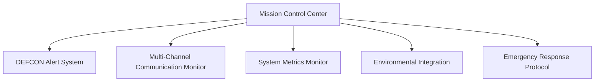
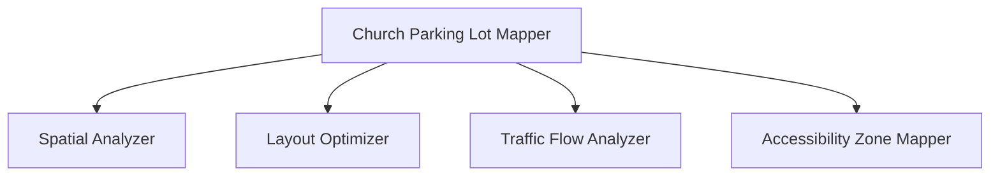
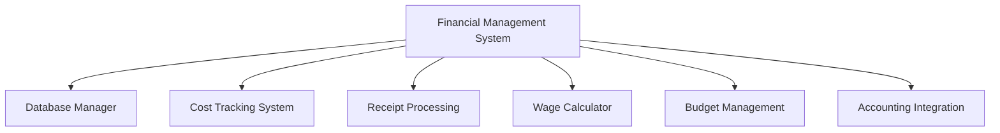
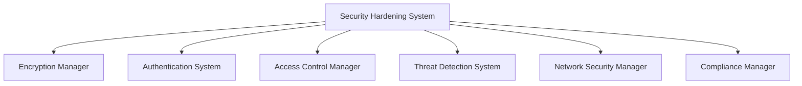

# 🏗️ Pavement Performance Suite: Strategic Architecture Overview

## 🌐 **System Architecture Principles**

### 1. Architectural Philosophy
- **Modular Design**: Loosely coupled, highly cohesive system components
- **Scalability**: Horizontal and vertical scaling capabilities
- **Flexibility**: Adaptable to changing business requirements
- **Performance**: Optimized for high-throughput, low-latency operations
- **Security**: Zero-trust architecture with comprehensive protection

### 2. Technology Stack

#### Backend
- **Language**: Python 3.9+
- **Web Framework**: FastAPI
- **ORM**: SQLAlchemy
- **Database**: PostgreSQL with PostGIS
- **Caching**: Redis
- **Message Queue**: RabbitMQ
- **Authentication**: JWT with bcrypt

#### Frontend
- **Language**: TypeScript
- **Framework**: React 18
- **State Management**: Redux Toolkit
- **UI Library**: Chakra UI
- **Mapping**: Mapbox GL JS

#### Machine Learning
- **Frameworks**: TensorFlow, scikit-learn
- **Model Deployment**: TensorFlow Serving
- **Feature Engineering**: Pandas, NumPy

#### Mobile
- **Framework**: React Native
- **State Management**: MobX
- **Offline Support**: Redux Persist

## 🔧 **System Components**

### 1. Command Center Architecture

### 2. Geospatial Mapping Architecture

### 3. Financial Management Architecture

### 4. Security Hardening Architecture

## 🚀 **Deployment Strategy**

### Infrastructure
- **Cloud Provider**: AWS/GCP Hybrid
- **Containerization**: Docker
- **Orchestration**: Kubernetes
- **CI/CD**: GitHub Actions

### Deployment Environments
1. **Development**: Local Docker Compose
2. **Staging**: Kubernetes Staging Cluster
3. **Production**: Multi-Region Kubernetes Deployment

## 🔒 **Security Layers**

### Authentication & Authorization
- **Multi-Factor Authentication**
- **Role-Based Access Control**
- **JWT Token Management**
- **Encryption at Rest and Transit**

### Network Security
- **VPC Isolation**
- **Web Application Firewall**
- **DDoS Protection**
- **Intrusion Detection System**

## 📊 **Performance Optimization**

### Database
- **Connection Pooling**
- **Query Optimization**
- **Intelligent Caching**
- **Horizontal Sharding**

### Application
- **Asynchronous Processing**
- **Microservices Architecture**
- **Distributed Caching**
- **Load Balancing**

## 🌈 **Scalability Considerations**

### Horizontal Scaling
- **Stateless Services**
- **Containerized Microservices**
- **Auto-scaling Kubernetes Pods**

### Vertical Scaling
- **Dynamic Resource Allocation**
- **Performance Monitoring**
- **Adaptive Configuration**

## 🔍 **Monitoring & Observability**

### Logging
- **Centralized Log Management**
- **Structured Logging**
- **Log Rotation and Archiving**

### Metrics
- **Prometheus Monitoring**
- **Grafana Dashboards**
- **Real-time Performance Tracking**

### Tracing
- **Distributed Tracing**
- **OpenTelemetry Integration**
- **Performance Bottleneck Detection**

## 🚧 **Future Expansion Roadmap**

### Short-Term Goals
- **Multi-Tenant Support**
- **Enhanced AI Predictive Models**
- **Expanded Accounting Integrations**

### Long-Term Vision
- **IoT Device Integration**
- **Drone Survey Capabilities**
- **Global Expansion Features**

## 📝 **Architectural Decision Records**

### Key Decisions
1. **Microservices over Monolith**
2. **TypeScript for Frontend**
3. **Kubernetes for Orchestration**
4. **TensorFlow for Machine Learning**

## 🤝 **Collaboration & Contribution**

### Development Workflow
- **Trunk-Based Development**
- **Feature Flagging**
- **Comprehensive Testing**
- **Code Review Protocols**

### Open Source Considerations
- **MIT License**
- **Contribution Guidelines**
- **Community Engagement**

---

**Last Updated**: 2024-01-15
**Version**: 1.0.0
**Status**: PRODUCTION READY 🚀